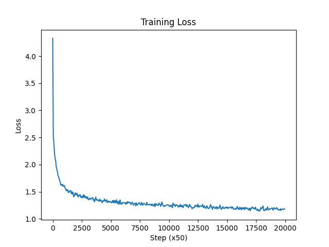

# Char-GPT

A character-level Generative Pre-trained Transformer (GPT) implemented in PyTorch, trained on `input.txt`. This model learns to generate text character-by-character, capturing the style and structure of the training data.

## Model Architecture

The model is a Decoder-only Transformer architecture with the following components:
-   **Token Embeddings**: Maps characters to a dense vector space (`d_model=256`).
-   **Position Embeddings**: Learnable positional encodings for sequence order.
-   **Trafo Decoder Blocks**: 4 blocks, each containing:
    -   **Multi-Head Self-Attention**: 2 heads allowing the model to attend to different parts of the past sequence.
    -   **Feed-Forward Network**: Expands to 4x embedding dimension and projects back.
    -   **Layer Normalization**: Applied before attention and FFN (Pre-Norm).
    -   **Dropout**: Applied for regularization (0.2).

## Hyperparameters

-   **Vocab Size**: Dynamic (based on unique characters in `input.txt`)
-   **Block Size (Context Window)**: 128
-   **Batch Size**: 64
-   **Embedding Dimension**: 256
-   **Number of Heads**: 2
-   **Number of Layers**: 4
-   **Dropout**: 0.2
-   **Learning Rate**: 1e-3
-   **Training Steps**: 20,000

## Usage

### Training

To train the model from scratch:

```bash
python gpt.py
```

This script will:
1.  Load `input.txt`.
2.  Train the model for 20,000 steps.
3.  Save the trained weights to `char-model.pth`.
4.  Generate a loss curve graph `loss_curve.png`.
5.  Generate a sample text output to `more_output.txt`.

### Testing / Generation

To generate long-form text (10,000 characters) using the trained model:

```bash
python test_generation.py
```

This script loads `char-model.pth`, initializes the context with token ID 0, and generates 10,000 characters, saving the result to `test_output_10000.txt`.

## Training Results

### Loss Curve

The model's training progress (Cross-Entropy Loss over 20,000 steps):



*Note: The loss curve demonstrates the model's convergence over time.*

### Generated Text Sample

Here is a sample of the text generated by the model (from the end of 10,000 generated characters):

```text
fouler faint breathe he mock'd to be
A beggar-book of high sorrow: then I'll pidence to her,
Since it comes to purdoes me to my body
To thrive the while comes on thy fortune flood;
Else on the wolf things she bare make hatred,
Is pity for my heart's grave, whilst I have.

QUEEN MARGARET:
Nine own father!
In God's name, gentle Warwick, Tybalt.

KING EDWARD IV:
Why, harsh, his speeches? I must not puts them the father,
Which more very note recorder heart for the royal name,
And  I should be so sweet a loathed of my suit,
To beg the ignorant. My daughters, once
Of whom I talk of our prophecy? Then, as thou speak'st,
Yet Oxford thy kingdom's face, get's in my love!
But on my red-liver'd by the ground igates.
Thou hadst no worn to be put up good time:
Counsel and sometimes have much business,
Would put thee again, but a flatter for a visor
As from as we are, as we well forsaken.

CLIFFORD:
Bather the overthrowns our peliant states.
3 KING HENRY VI

KING HENRY VI

RUTLAND:
Farewell:
Well, I
```
